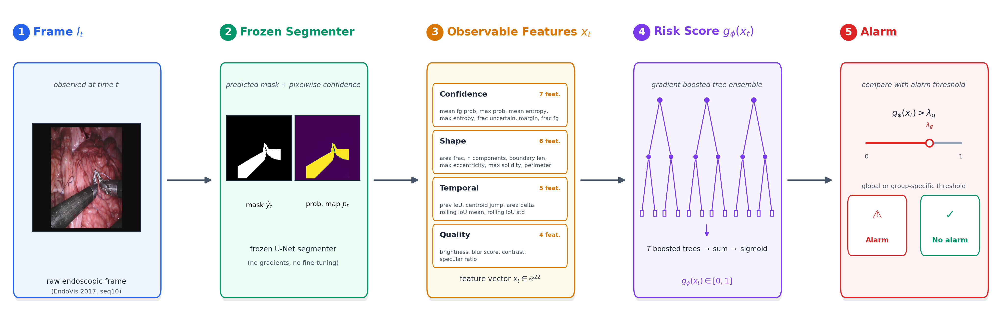

# Beyond Uncertainty: Generalizable Failure Monitoring for Surgical Segmentation under Acquisition Degradation

<p align="center">
  <a href="https://github.com/dinhieufam/tcsr-monitor/blob/master/LICENSE">
    
  </a>
  <a href="https://www.python.org/">
    
  </a>
  <a href="https://hydra.cc/">
    
  </a>
  <a href="https://github.com/dinhieufam/tcsr-monitor/stargazers">
    
  </a>
</p>

<p align="center">
  <strong>📘 MICCAI 2026 Workshop on Uncertainty for Safe Utilization of Machine Learning in Medical Imaging (UNSURE) — Poster</strong>
</p>

<p align="center">
  <a href="https://github.com/dinhieufam"><b>Hieu D. Pham</b></a>, <b>Dang P. M. Cao</b>, <b>Thanh Trung Huynh</b>
</p>

<p align="center">
  <sub>College of Engineering and Computer Science, VinUniversity</sub>
</p>

---

> ⭐ **If you find this work useful, please consider starring the repo and citing our paper!**

---

## 🧠 Abstract

Surgical segmentation networks can fail **silently** under acquisition degradation: the predicted mask is wrong while the model remains confident, so commonly used uncertainty scores stay low precisely when an alarm is needed.

We present **TCSR-Monitor** (**T**emporal **C**onformal **S**urgical **R**isk Monitor), a post-hoc failure-monitoring framework that combines confidence with complementary observable **shape**, **temporal-consistency**, and **image-quality** cues to estimate segmentation failure risk:

- 🧊 **Frozen-model wrapper** — requires no access to model internals, no retraining
- 🚫 **No ground truth at deployment** — operates purely on observable, runtime features
- 🎯 **Conformal-calibrated alarms** — a coverage guarantee on missed failures at a user-specified rate
- 🌊 **Validated under distribution shift** — leave-one-corruption-out (LOCO) protocol tests whether learned alarms stay credible on *unseen* acquisition degradations, not just held-out frames
- 🔁 **Zero-shot transfer** — features carry over to an unseen SAM2 segmenter without retraining the monitor

Evaluated on EndoVis 2017 across three complementary protocols, TCSR-Monitor generalizes to unseen degradations where confidence-based baselines fall apart, and a circularity control confirms it predicts *segmentation failure*, not merely *corrupted input*.

All **code, configs, and evaluation artifacts** are publicly available in this repository.

<p align="center">
  
</p>

---

## 🧰 Repository Overview

This repository provides scripts for the full pipeline underlying the paper:

- 🩻 **Segmentation** — training/inference for the wrapped frozen segmenter (U-Net, DeepLabV3+, SegFormer, SAM2)
- 🚩 **Failure labeling** — IoU-threshold failure labels from predictions vs. ground truth
- 🧬 **Feature extraction** — the 22 observable confidence / shape / temporal / quality features
- 📈 **Monitor training** — learned risk score (XGBoost / random forest / logistic regression / GRU)
- 🛡️ **Conformal calibration** — split conformal + Mondrian conformal risk control
- ⚖️ **Baselines** — max-softmax, entropy, temperature scaling, TTA variance, temporal heuristic, feature-distance OOD
- 📊 **Evaluation** — clean/LOCO/severity-extrapolation/cross-dataset protocols, circularity control, figures

It includes model preparation, training & inference scripts, and evaluation/benchmarking utilities — all driven by [Hydra](https://hydra.cc/) configs so every run is reproducible from a single override.

---

## 📊 Headline Results

| Method | τ=0.5 AUROC ↑ | τ=0.5 AUPRC ↑ | τ=0.75 AUROC ↑ | τ=0.75 AUPRC ↑ |
|---|---|---|---|---|
| **TCSR-Monitor (ours)** | **0.877** | 0.468 | **0.793** | **0.301** |
| Predictive entropy | 0.764 | **0.635** | 0.483 | 0.220 |
| Max-softmax | 0.536 | 0.087 | 0.509 | 0.085 |
| Temporal heuristic | 0.338 | 0.013 | 0.460 | 0.074 |

*Held-out clean EndoVis 2017 test set (seed 0, point estimates — 825 frames from
3 held-out sequences; frame-level scores are correlated within a sequence, see
the paper for sequence-level bootstrap CIs). Failure prevalence: 1.7% at
τ=0.5, 6.9% at τ=0.75. Monitor inference latency: 0.36 ms/frame (mean, CPU
feature extraction + XGBoost).*

Under **leave-one-corruption-out (LOCO)** evaluation — the paper's core robustness claim — the monitor generalizes to unseen acquisition degradations:

> **0.814 AUROC** vs. **0.481** for predictive entropy (26/30 corruption × severity cells won)

See the paper for the full generalization hierarchy, circularity control, Mondrian conformal calibration, and SAM2 transfer results.

---

## ⚙️ Install

```bash
# Recommended: uv
make setup

# Or: conda
conda env create -f environment.yml
conda activate tcsr-monitor
pip install -e .
```

## 📦 Data Access

See [docs/datasets.md](docs/datasets.md) for download links, licenses, and checksums.

```bash
make data   # download + verify + build manifests (EndoVis 2017 + CholecSeg8k)
```

## 🔁 Reproduce Everything

```bash
make all    # full pipeline end-to-end
```

Or step-by-step — see [docs/reproduce.md](docs/reproduce.md).

<details>
<summary><b>🔹 Core pipeline scripts (Click to expand)</b></summary>

| Stage | Script | Makefile target |
|---|---|---|
| Download + manifest data | `scripts/00_download_data.py`, `scripts/01_build_manifests.py` | `make data` |
| Train segmentation backbone | `scripts/02_train_segmentation.py` | — |
| Run predictions | `scripts/03_run_predictions.py` | `make predict` |
| Build failure labels | `scripts/04_make_failure_labels.py` | `make labels` |
| Extract observable features | `scripts/05_extract_features.py` | `make features` |
| Train monitor + calibrate conformal | `scripts/06_train_monitor.py`, `scripts/07_calibrate_conformal.py` | `make monitor` |
| Run baselines | `scripts/08_run_baselines.py` | `make baselines` |
| Evaluate | `scripts/09_evaluate.py` | `make eval` |
| Make figures | `scripts/10_make_figures.py` | `make figures` |

Numbered variants (`03b`–`03d`, `04b`–`04c`, `06b`, `07b`–`07d`, `08b`, `09b`–`09g`, `10a`–`10c`, `11b`–`11d`, `12`) run the paper's additional protocols — out-of-fold predictions, corruption sweeps, LOCO/Mondrian calibration, learner/feature ablations, SAM2 transfer, and the external CholecSeg8k evaluation. See [docs/reproduce.md](docs/reproduce.md) for the full list.

</details>

---

## 🗂️ Repo Map

```
configs/      Hydra config tree — change dataset/model/feature/baseline here
src/tcsr/     Installable package (data, segmentation, features, labels,
              monitor, conformal, baselines, evaluation, viz, utils)
scripts/      CLI entrypoints 00–12 (thin Hydra @main wrappers)
tests/        Unit tests + 20-frame smoke pipeline
results/      Committed metrics tables and paper figures
docs/         Dataset access + step-by-step reproduction guide
```

### Extend the system

| What to add | Where |
|---|---|
| New dataset | `src/tcsr/data/<name>.py` + `configs/data/<name>.yaml` |
| New segmentation model | `src/tcsr/segmentation/models.py` registry + `configs/seg_model/<name>.yaml` |
| New feature group | `src/tcsr/features/<name>.py` + `configs/features/all.yaml` |
| New baseline | `src/tcsr/baselines/runners.py` + `configs/baseline/<name>.yaml` |

---

## 👨‍💻 Core Developer

**Hieu D. Pham**

College of Engineering and Computer Science, VinUniversity

📧 [24hieu.pd@vinuni.edu.vn](mailto:24hieu.pd@vinuni.edu.vn)
🔗 [https://dinhieufam.github.io](https://dinhieufam.github.io)

---

## 🧾 Citation

If you use this code, please cite:

```bibtex
@inproceedings{tcsr2026,
  title     = {Beyond Uncertainty: Generalizable Failure Monitoring for Surgical
               Segmentation under Acquisition Degradation},
  author    = {Pham, Hieu D. and Cao, Dang P. M. and Huynh, Thanh Trung},
  booktitle = {MICCAI Workshop on Uncertainty for Safe Utilization of Machine
               Learning in Medical Imaging (UNSURE)},
  year      = {2026},
}
```

### Dataset citations

- **EndoVis 2017:** Allan et al., 2019.
- **CholecSeg8k:** Hong et al., 2021.
